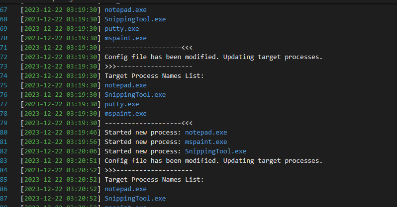

### Note
The following code use Windows-style file paths. These can be run from Visual Studio Code (VSCode), a cross-platform code editor.


# Instruction Document: Running the Program

#### Prerequisites:
1. **Compiler:**
   - Ensure you have a C++ compiler installed on your system. We recommend using **g++**.

#### Steps:

1. **Download the Source Code:**
   - Download the source code files (`main.cpp`, `file.cpp`, `process.cpp`, `log.cpp`, `file.h`, `process.h`, `log.h`) to a directory of your choice.

2. **Open a Terminal (Command Prompt):**
   - Open a terminal or command prompt window.

3. **Navigate to the Directory:**
   - Use the `cd` command to navigate to the directory where you saved the source code files.

     ```bash
     cd path/to/your/source/code
     ```

4. **Compile the Code:**
   - Compile the source code using the following command:

     ```bash
     g++ main.cpp file.cpp process.cpp log.cpp -o main.exe -lPsapi
     ```

   - This command compiles the source code files into an executable named `main.exe`. The `-lPsapi` option is used to link the Psapi library.

5. **Run the Program:**
   - After successful compilation, run the executable:

     ```bash
     ./main.exe
     ```

   - This will execute the process monitoring program.

6. **Check Output:**
   - The program will display output and log messages on the console. Check the console for information related to process monitoring and file processing.

7. **Terminate the Program:**
   - To stop the program, press `Ctrl+C` in the terminal where the program is running.

#### Notes:
- Ensure that the `g++` compiler and necessary libraries are properly installed on your system.
- Adjust the compilation command if needed based on your system environment.


# Instruction Document: Configuring `config.txt` and Viewing Output Log

#### Configure `config.txt`:

1. **Open `config.txt`:**
   - Locate the `config.txt` file in the same directory as your executable and open it using a text editor.

2. **Add Process Names:**
   - Add the process names that you want to monitor. Each process name should be on a new line.
   - Example `config.txt`:

     ```plaintext
     notepad.exe
     SnippingTool.exe
     mspaint.exe
     putty.exe
     ```

   - Save the changes to `config.txt`.

#### View Output Log (`output.log`):

1. **Open `output.log`:**
   - Locate the `output.log` file in the same directory as your executable and open it using a text editor.

2. **Review Log Messages:**
   - The `output.log` file contains log messages generated by the program, including important events logged by the watchdog.
   - Example log entry:

     ```
     [Timestamp] Started new process: notepad.exe
     ```

3. **Monitor Important Events:**
   - Look for entries related to the watchdog, such as process monitoring updates and events triggered by the watchdog.
   - Example log entry:

     

4. **Review Timestamps:**
   - Each log entry is timestamped, allowing you to track when events occurred.

#### Notes:
- Ensure that the process names in `config.txt` match the actual names of the processes you want to monitor.
- Regularly check the `output.log` file for updates and monitor important events triggered by the watchdog.
